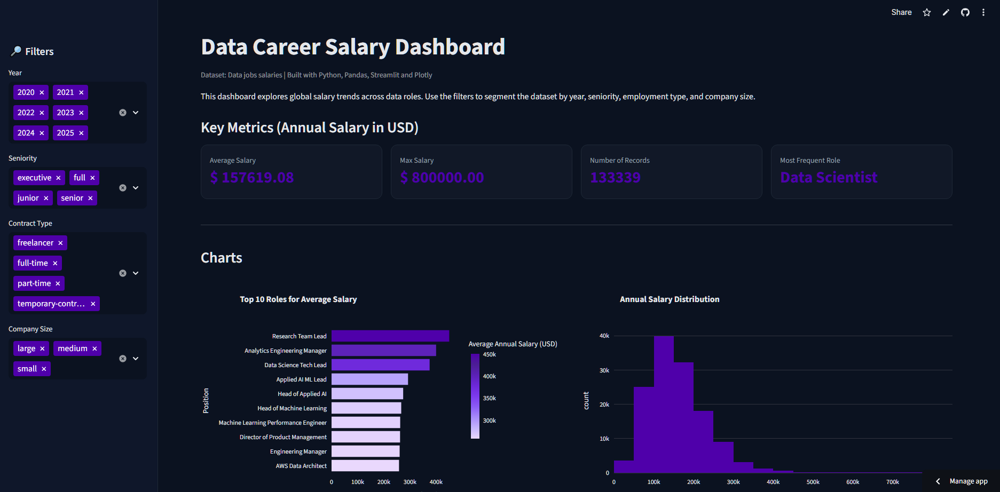

# Global Data Salaries Dashboard

Interactive dashboard developed to explore global salary trends in data careers, focusing on data cleaning, analysis, and visualization.

This project was built after completing the **"Imersão de Dados"** course by Alura, with the goal of applying the knowledge gained in real-world data treatment and dashboard development using Python and Streamlit.

🔗 Live application:  
https://dashboard-data-career-salaries.streamlit.app

---

## Project Overview

The dashboard allows users to explore salary data across data-related roles worldwide.  
It provides interactive filters and visualizations to analyze salary distribution, seniority levels, employment types, remote work patterns, and geographic differences.

The objective of this project was to simulate a real analytics product and strengthen practical skills in:

- Data cleaning and transformation
- Exploratory data analysis
- Data visualization
- Dashboard development
- Deployment using Streamlit Cloud

---

## Features

- Interactive filters by:
  - Year
  - Seniority level
  - Employment type
  - Company size

- Key metrics:
  - Average salary
  - Maximum salary
  - Total records
  - Most frequent roles

- Visual insights:
  - Top-paying roles
  - Salary distribution
  - Remote work patterns
  - Country-level salary comparison

---

## Tech Stack

- Python
- Pandas
- Streamlit
- Plotly
- Pycountry

---

## Data Source

Dataset containing global salary information for data-related roles, including job titles, seniority levels, location, and compensation.

---

## Learning Objectives

This project was created to:

- Apply concepts learned during the Alura Data Immersion
- Practice real-world data handling
- Build a professional interactive dashboard
- Improve storytelling with data
- Create a portfolio-ready project for data roles

---

## Author

Developed by Daniel Silva  
